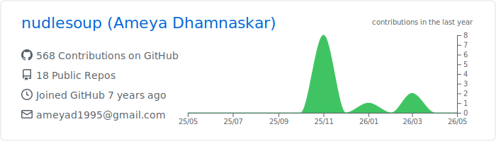
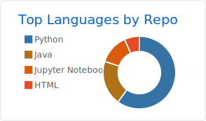
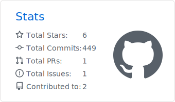

### Hi there 👋
- :octocat: More about me at : <a href="https://nudlesoup.github.io">https://nudlesoup.github.io</a>
- ⛅️ I’m currently working as Computer vision researcher at <a href="https://www.iri.upc.edu/research">Institut de Robotica Industrial</a>, Barcelona.
- 🎈 I'm advised by <a href="https://www.iri.upc.edu/people/fmoreno/">Prof. Francesc Moreno</a> and <a href="https://www.iri.upc.edu/people/mdimiccoli/">Prof. Mareilla Dimiccoli</a>.
- 🐧 My current research focuses on building Self-supervised approaches to effectively improve 3D human egopose estimations.
- 📂 Previously, I was a Software Developer at <a href="http://www.tescobengaluru.com/">Tesco Technologies</a>.
- 📫 How to reach me: ameya.dhamanaskar@upc.edu

[Blogs](http://www.medium.com/@ameyadhamnaskar)

